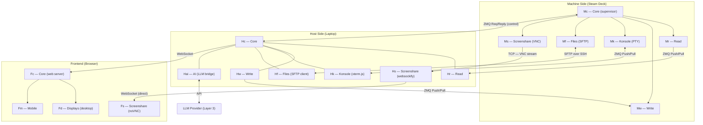

# Project Solleclaire
Session handoff document v5 — component map, diagram, and action plan

---

## Project goal

Build a system where an AI (LLM) can control a real Linux desktop — navigating a browser, managing files, and interacting with GUI apps — while a human observer watches it happen live on screen. The AI receives all machine data as structured text (JSON), never screenshots. The desktop remains fully visible and "pretty" to watch.

## Core constraints

- No vision or screenshot-based control — all data must be structured text
- No coordinate-based mouse clicks — all interaction is identity-based (role, label, ID)
- Free and open-source software throughout (LLM provider is the exception)
- No console-only interaction for the main AI flow — real GUI apps must be navigated
- The AI machine must be physically separate from the controller machine
- Machine components must be portable — swapping Steam Deck for Pi or VM requires only new Machine components, Host stays unchanged

---

## Hardware

### AI machine — Steam Deck + official dock
- Runs SteamOS (Arch-based), Desktop Mode with KDE Plasma
- Dedicated Linux user for the project — not the default `deck` user
- Project user has no sudo — intentional, limits AI blast radius
- Used for gaming separately — switching modes, no resource conflict
- Official dock provides ethernet port for direct wired connection

### Controller — developer's laptop
- Runs all Host components
- All Machine-side code written and deployed from here via VS Code Remote SSH
- Deck keyboard and screen never needed for development

### Network
- Direct ethernet cable: laptop ↔ Steam Deck dock
- Static IPs — e.g. `192.168.50.1` laptop, `192.168.50.2` Deck
- Private dedicated link, nothing through the router
- Multiple channels share the cable on separate ports — no conflict

---

## Adapter pattern — portability principle

Machine components own all platform-specific logic. They format outgoing data to a standard schema and translate incoming commands from a standard format before execution. Host components speak only the standard protocol and never know what platform is underneath. Swapping Steam Deck for a Pi, VM, or Windows machine means writing new Machine components only.

The schema itself should be defined in a `/protocol` folder once real data has been observed in Phase 2/4. Do not pre-design the schema before seeing real data.

---

## Component diagram



---

## Component map

```
MACHINE SIDE (Steam Deck)
──────────────────────────────────────────────────────────
Mc  Machine Core — process supervisor, always running
    Registered as a systemd user service on the project user
    Starts on login, no sudo needed
    Spawns and auto-restarts Mr, Mw, Mk, Mf, Ms
    Owns the control channel to Hc
    No data passes through it — purely operational
    │
    ├── Mr  Machine Read
    │       Sources: Playwright (browser), AT-SPI2 (desktop)
    │       Pipeline with logs at every stage:
    │         [1] Raw capture from AT-SPI2 / Playwright  → LOG
    │         [2] Structural filtering                   → LOG
    │         [3] Format to standard read schema         → LOG
    │         [4] Transmit to Hr via ZMQ push
    │
    ├── Mw  Machine Write
    │       Receives standard command format from Hw
    │       Translates to platform-specific actions
    │       Executes via Playwright, AT-SPI2, xdotool, xclip
    │       Handles: identity-based clicks, clipboard paste,
    │       keyboard input, hotkeys, sequential commands, macros
    │       Logs incoming commands and execution results
    │
    ├── Mk  Machine Konsole (terminal)
    │       Built around a PTY — NOT raw stdout
    │       PTY required for ANSI codes, cursor positioning,
    │       and full-screen TUI apps (Claude Code, htop, etc.)
    │       Raw stdout was tried in a prior prototype and failed
    │       Streams PTY output to Hk, receives keystrokes back
    │
    ├── Mf  Machine Files
    │       SSHFS mountpoint — a folder on the Host mounted onto the Deck
    │       Appears as a local folder to the AI — no explicit transfer needed
    │       AI can read, write, and create files here like any local directory
    │       Backed by a fixed-size disk image on the laptop — configurable by the user
    │       Full is full — no risk of filling the laptop's disk unexpectedly
    │
    └── Ms  Machine Screenshare
            Runs a VNC server (TigerVNC or x11vnc)
            Captures the KDE desktop continuously
            Broadcasts as a VNC stream over TCP to Hs

HOST SIDE (Laptop)
──────────────────────────────────────────────────────────
Hc  Host Core — central coordinator
    Connects Hr, Hw, Hk, Hf, Hai, Fc via internal routing
    Owns control channel to Mc (restart commands, heartbeat)
    Monitors heartbeat — detects Deck-side failure proactively
    Decides when machine state is stable enough to prompt AI
    Does NOT handle screenshare traffic — Hs is a direct pipe
    │
    ├── Hr  Host Read
    │       Receives formatted data from Mr
    │       Contextual filtering:
    │         - select elements relevant to current task
    │         - truncate page text to LLM-appropriate length
    │         - produce final JSON for Hai and Fd display
    │
    ├── Hw  Host Write
    │       Defines all tool call schemas (AI-facing)
    │       Translates tool calls to standard command format
    │       Sends to Mw via ZMQ push
    │       Owns all translation logic — Mw stays unaware of tool calls
    │       Curated subset of what Mw can do
    │
    ├── Hk  Host Konsole
    │       Renders PTY stream from Mk using xterm.js
    │       Sends keystrokes back to Mk
    │       Human-only by default
    │
    ├── Hf  Host Files
    │       Owns the shared disk image — configurable size, created on first setup
    │       Mounts it onto the Deck via SSHFS over the existing SSH connection
    │       File browser panel in Fd for the human to manage shared files
    │       Human manages the folder from the laptop; AI accesses it from the Deck
    │
    ├── Hs  Host Screenshare
    │       Runs websockify — protocol bridge only
    │       Receives VNC TCP stream from Ms
    │       Rewraps it as WebSocket frames for the browser
    │       Connects directly to Fs — bypasses Hc entirely
    │       Kept separate to avoid pixel data competing with
    │       AI/data traffic on the same process
    │
    ├── Hai Host AI
    │       Handles all LLM communication
    │       Manages prompt construction and response parsing
    │       Designed to support multiple providers (swappable)
    │       Expandable: cost tracking, retry logic, fallback
    │
    ├── Fc  Frontend Core
    │       Web server — hosts the frontend on a local port
    │       Single URL the user opens in any browser
    │       Browser opens two WebSocket connections:
    │         → Hc  for all AI/data/control traffic
    │         → Hs  for screenshare (direct, bypasses Hc)
    │       │
    │       ├── Fd  Frontend Displays (desktop)
    │       │       Multi-panel dashboard layout
    │       │       Panels: chat, Hr display, tool call log,
    │       │       Hk terminal, Hf file browser, Fs screenshare
    │       │
    │       └── Fm  Frontend Mobile
    │               Portrait single-panel with tab switching
    │               Panels: chat, status, optional screenshare
    │               Separate layout — not a responsive version of Fd
    │
    └── L   Logs — toggleable at every boundary
            Mr raw, filtered, formatted (all three stages)
            Hr input and output, Hw in and out
            Mw in and out, Mk stream, Mc heartbeat
            All individually toggleable

FRONTEND (runs in browser)
──────────────────────────────────────────────────────────
Fs  Frontend Screenshare
    noVNC — JavaScript library running in the browser
    Decodes VNC data from WebSocket (Hs)
    Renders onto HTML canvas inside Fd or Fm
```

---

## Communication channels

### Machine ↔ Host (over direct ethernet)

| Channel | From | To | Protocol | Direction |
|---|---|---|---|---|
| Read | Mr | Hr | ZMQ Push/Pull | Unidirectional |
| Write | Hw | Mw | ZMQ Push/Pull | Unidirectional |
| Control | Mc | Hc | ZMQ Req/Reply | Bidirectional |
| Screenshare | Ms | Hs | TCP (VNC) | Unidirectional |
| Files | Hf | Mf | SSHFS over SSH | Bidirectional |
| Console | Mk | Hk | ZMQ Push/Pull | Bidirectional |

### Host ↔ Frontend (over localhost)

| Channel | From | To | Notes |
|---|---|---|---|
| Data/AI/control | Hc | Fc → Fd/Fm | WebSocket — all non-screenshare traffic |
| Screenshare | Hs | Fs | WebSocket — direct bypass of Hc |

### The screenshare chain

```
Ms (VNC server)  →  captures pixels, speaks VNC over TCP
Hs (websockify)  →  rewraps TCP packets as WebSocket frames
Fs (noVNC)       →  decodes VNC data, renders on HTML canvas
```

Hs bypasses Hc to avoid pixel data competing with AI/data traffic on the same process.

> **Console warning:** Mk must use a PTY — not raw stdout. Raw stdout strips ANSI codes, breaking colors, cursor positioning, and all full-screen TUI apps. Confirmed broken in a prior prototype. Do not revisit raw stdout for this component.

---

## Tool call surface (Hw → Mw)

### Browser — via Playwright
```
browser_navigate(url)
browser_click(role, label)
browser_type(label, text)
browser_select(label, option)
browser_scroll(direction, amount)
browser_focus(label)
browser_get_state()
browser_wait(condition)
```

### Desktop — via AT-SPI2
```
desktop_click(app, role, label)
desktop_get_state()
desktop_focus_app(name)
desktop_get_open_windows()
```

### Input — keyboard and clipboard
```
input_key(key)              # "Return", "Escape", "Tab"
input_hotkey(keys)          # ["ctrl","c"], ["alt","F4"]
input_text_clipboard(text)  # set clipboard then Ctrl+V
```

Clipboard preferred over keystroke simulation. Hk and Hf are human-only by default.

---

## Data flow — read cycle

```
1. Mr continuously captures and streams formatted state to Hr
2. Hc monitors stream, waits for stability (nothing loading/transitioning)
3. When stable, Hc forwards sanitized state to Hai
4. Hai constructs prompt, sends to LLM
5. LLM returns tool call
6. Hw translates tool call → standard command → Mw
7. Mw executes, result logged
8. Mr captures new state, cycle continues
```

---

## Mock components

| Real | Mock | Purpose |
|---|---|---|
| Mr | Mock reader | Emits fake state — test Hr and Hc without the Deck |
| Mw | Mock writer | Logs received commands — confirm Hw translation |
| Hai | Mock LLM | Scripted responses — test Hc without API calls |
| Hai | Human (Phase 10) | Developer as AI — validates pipeline before LLM |

---

## SteamOS notes

- Root filesystem immutable — `pacman -S` installs wiped on updates
- All dependencies in Python venv under `~/` — persistent
- Playwright Chromium at `~/.cache/ms-playwright` — safe
- AT-SPI2 already present — KDE depends on it
- Mc as `systemd --user` service — starts on login, no root
- `sudo steamos-readonly disable` for system packages — last resort only

---

## Reference — OpenCode

OpenCode (SST) — study for agent loop and tool dispatch architecture. Webfetch is plain HTTP, not a real browser. Cannot replace Playwright.

---

## Action plan

### Phase 1 — QOL and setup
- Create project user on the Deck
- Configure static IPs, verify ethernet link
- Set up VS Code Remote SSH
- Implement Mc as systemd user service
- Establish Mc ↔ Hc control channel for remote restarts
- Verify full remote workflow: edit → deploy → restart from laptop

### Phase 2 — Full read flow — raw
- Implement Mr with no filtering — capture everything
- Implement Hr — receive and store raw data
- Logs at Mr raw stage and Hr input
- Observe real data to inform schema design later

### Phase 3 — Read stream reliability
- Switch to continuous ZMQ push/pull stream
- Test latency, frequency, stability
- Transport reliability test — not LLM consumption test
- Draft Hc stability detection logic

### Phase 4 — Read sanitization and schema
- Add structural filtering in Mr (stage 2) with log
- Design read schema from real Phase 2 data
- Add schema formatting in Mr (stage 3) with log
- Add contextual filtering in Hr
- Document in `/protocol/read_schema.json`
- Validate: a human reading Fd should understand machine state clearly

### Phase 5 — Machine write — raw capability
- Implement Mw — full action set, raw command port for testing
- No Hw yet — test directly via SSH terminal
- Exhaustive capability. Unused actions are fine.
- Log all commands and results

### Phase 6 — Host write — tool calls and protocol
- Design write schema from what Mw can do
- Document in `/protocol/write_schema.json`
- Implement Hw — schemas, translation, ZMQ send
- Test with mock Mw before touching real actions

### Phase 7 — Console — Mk and Hk
- Implement Mk with PTY — not raw stdout
- Implement Hk with xterm.js
- Verify TUI apps work: Claude Code, htop, etc.
- Human-only by default

### Phase 8 — File transfer — Mf and Hf
- Create configurable shared disk image on the laptop (user sets size on first setup)
- Mount it onto the Deck via SSHFS over the existing SSH connection
- Verify AI can read and write to the mountpoint as a local folder
- Implement Hf file browser panel in Fd for human-side file management
- Test large file behavior — confirm size cap holds

### Phase 9 — Frontend basics — Fc and Fd
- Implement Fc as web server on local port
- Initial Fd panels: chat, Hr display, tool call log, Hk, Hf
- Two WebSocket connections: Hc (data) and Hs (screenshare)
- Fs not required yet

### Phase 10 — Dev frontend — human as AI
- Dev interface: receive read data, send write commands manually
- Dev versions of Hk and Hf
- Validates full pipeline before LLM
- Makes pipeline vs LLM bugs distinguishable

### Phase 11 — Backend core integration
- Implement Hc — connect all host components
- Wire stability detection
- Full pipeline tests via dev frontend

### Phase 12 — Screenshare — Ms, Hs, Fs
- Install VNC server on Deck (Ms)
- Set up websockify on laptop (Hs)
- Add noVNC panel in frontend (Fs)
- Hs → Fs direct, bypasses Hc
- Verify framerate and latency

### Phase 13 — Mobile frontend — Fm
- Separate portrait-mode layout, not a responsive Fd
- Single-panel with tab switching
- Panels: chat, status, optional screenshare

### Phase 14 — LLM integration — Hai
- Connect real LLM provider
- Write system prompts and tool call instructions
- Test with mock Hc first

### Phase 15 — End-to-end tests
- Full system with real LLM and real machine
- Classify failures: pipeline, sanitization, or LLM reasoning

### Phase 16 — Frontend polish
- Improve all Fd and Fm panels
- Better tool call visualisation and UX
- Expand Fs interactivity if desired
